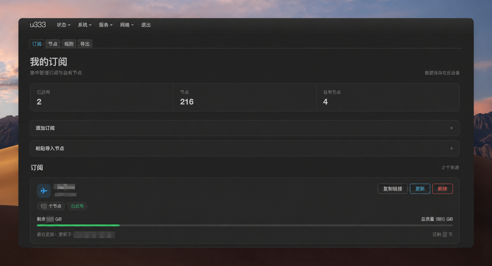
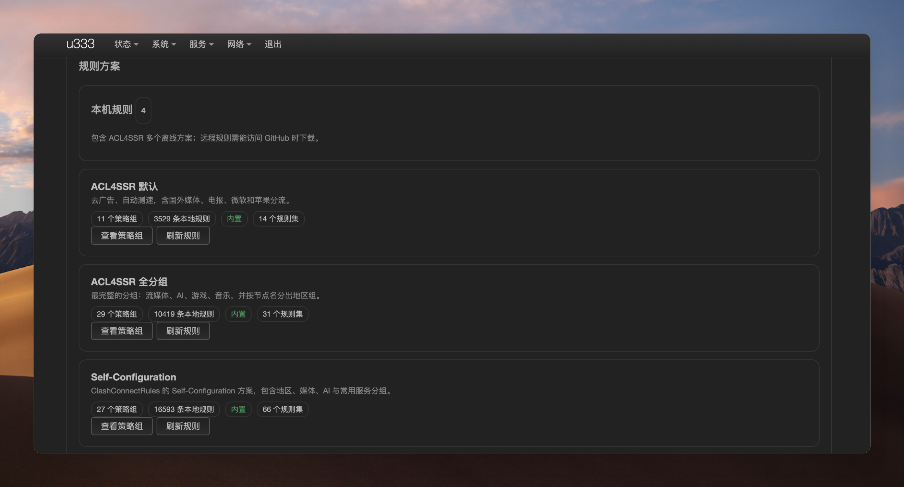

# openwrt-tower

这是 [酱紫表的「塔台 Tower」](https://github.com/pengchujin/tower) 的 OpenWrt / LuCI 适配项目。感谢原作者开源 Tower 的产品设计与代码。本仓库由 kenzok8 维护，不是原版 Tower 的官方版本。

Tower 是一个「订阅、节点、规则、导出」工作台：在路由器上整理机场订阅和自有节点，选出要用的节点与规则方案，再生成适合目标客户端的配置。它本身不是代理内核，不会代替 OpenClash、Nikki、Clashoo、Momo 或 daede 接管流量。

## 产品预览

展示页面，实际数据以你的路由器为准。

| 订阅管理 | 规则方案 |
|---|---|
|  |  |
| [规则导入](assets/screenshots/rules-import.png) | [客户端与节点导出](assets/screenshots/export-redacted.png) |

## Tower 能做什么

- 管理多个订阅与自有节点；查看机场流量、到期信息，更新订阅，编辑或删除自有节点。
- 按订阅来源和单个节点筛选、组合导出；例如只选机场 A 的节点，加上机场 B 的部分节点与自建节点。
- 使用内置的 ACL4SSR、Self-Configuration、kenzok8 方案，或自行导入 Clash YAML、subconverter .ini、Surge 规则方案。导入方案不会导入其中的节点。
- 在设备可以访问规则源时手动刷新远程规则缓存；保存方案不依赖实时下载。需要本地展开的目标在缓存缺失时报错，不会把规则悄悄改成直连；Mihomo 原生规则集导出会保留远程链接，目标客户端仍须能下载规则。
- 预览、复制或下载 Mihomo YAML、Surge / Shadowrocket 配置、sing-box JSON，以及单独的节点链接。
- 为同一台路由器上的插件生成只监听 127.0.0.1、可撤销的本机共享地址。它不是开放到局域网的公共订阅服务。

## 怎么用

1. 在 OpenWrt 上安装同一版本的 `tower` 和 `luci-app-tower`，进入 LuCI 的「服务 → Tower」。
2. 在「订阅」添加订阅链接，或粘贴节点链接导入自有节点。按需要更新订阅、勾选或编辑节点。
3. 在「规则」选择内置方案，或给自定义规则方案命名后导入；如方案引用远程规则集，等设备能访问规则源时点「刷新规则」。选用 Mihomo 原生规则集时，还须确认目标客户端可以访问相同规则源，或已具备对应缓存。
4. 在「导出」选择客户端、勾选节点、选择规则方案，再点「生成配置与链接」。先看预览和兼容提示，确认后复制或下载，并在目标插件里导入。

订阅凭据、节点密码和生成的配置保存在路由器本地；Tower 不把它们提交给在线转换服务。下载的配置文件仍包含节点密钥，请自行妥善保管。Tower 不提供机场、代理节点或规则源的可用性保证。

### 从源码打包

本仓库是 OpenWrt feed，包含 `tower/` 和 `luci-app-tower/` 两个包。将仓库作为 `src-link` feed 加入已准备好 Go 编译环境的 OpenWrt / ImmortalWrt SDK 或 Buildroot，再安装并编译两个包。当前 CI 仅构建 x86_64 的 24.10 和 25.12 候选包；其它架构尚未宣称通过验证。

```sh
echo 'src-link tower /absolute/path/to/openwrt-tower' >> feeds.conf
./scripts/feeds update -a
./scripts/feeds install -p tower tower luci-app-tower
make package/tower/compile V=s
make package/luci-app-tower/compile V=s
```

编译产物在 SDK 的 `bin/packages/` 下。首次安装或升级前，请备份设备上的 `/etc/config/tower` 和 `/etc/tower/`；后者包含真实订阅、节点与本机共享快照，不能上传到公开仓库。包安装后先在目标插件中校验导出的配置，再启用代理服务。

### OpenWrt 插件目标的边界

| 目标 | 当前导出 | 使用前注意 |
|---|---|---|
| OpenClash、Nikki、Clashoo (Mihomo) | Mihomo YAML | 导入后仍应使用目标插件的校验与日志确认可用 |
| Clashoo (sing-box)、Momo | sing-box JSON，默认分流 | Tower 规则方案尚不能等价导出；Momo 还需按其 TCP、UDP、DNS 模式调整入站 |
| daede | 节点订阅 | 规则仍由 daede 管理 |

不能保证每个目标都接受所有协议或规则类型。不支持的组合应明确报错；特别是将 Clash 的手动选择、规则集直接视作 dae 的同名能力，可能改变分流语义。因此 daede 目前只提供节点订阅，不生成所谓“完整分流配置”。

## 规则与存储

随包提供两个 ACL4SSR 离线方案及相关 .list 文件。Self-Configuration 和 kenzok8 内置方案提供策略组与远程规则引用，远程规则正文只在手动刷新后缓存，不打进软件包。来源和许可证见 [第三方声明](THIRD-PARTY-NOTICES.md)。

- /etc/tower/tower.json：订阅、节点和自定义规则方案。
- /etc/tower/rules/：随包安装的内置方案。
- /etc/tower/rule-cache/：手动刷新后缓存的远程规则。

本仓库只包含程序、LuCI 页面和公开内置规则，不包含真实订阅或测试设备配置。

## 开发检查

后端是 Go 程序，LuCI 页面位于 luci-app-tower/。在仓库根目录进入 tower/ 后依次运行 go test ./...、go vet ./... 和 go build ./cmd/tower。

OpenWrt 打包配方位于 tower/Makefile 和 luci-app-tower/Makefile。修改后应先在测试设备部署并检查 LuCI 桌面与手机布局、目标插件的配置校验，再发布。

## 许可证与致谢

源码采用 [MIT 许可证](LICENSE)。本项目基于 [pengchujin/tower](https://github.com/pengchujin/tower) 开发，感谢作者「酱紫表」。规则、图标和品牌素材各归其原作者或项目所有，详见 [第三方声明](THIRD-PARTY-NOTICES.md)。
